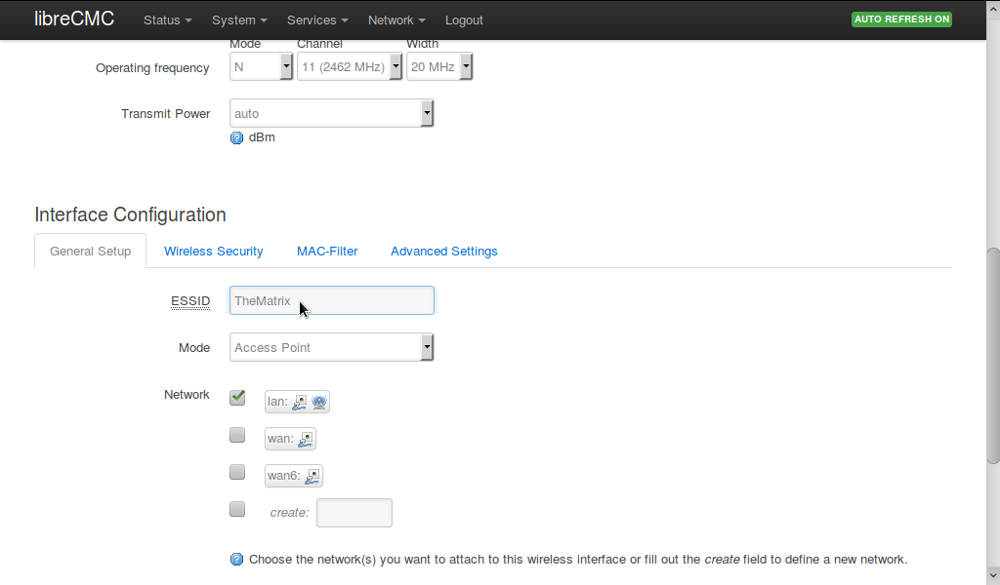

# Basic Wireless Settings

This document is only intended to cover the most basic details of
Wi-Fi settings on LibreCMC, for people who do not know much about
computer networking. Geeks are encouraged to simply log in
to `192.168.10.1` and experiment with the settings.

## Log in to the LuCi configuration interface

First, you need a physical connection to the LibreCMC Wi-Fi
router. The simplest way is to connect an Ethernet cable between the
Ethernet port on your computer, and the LAN port on your router. An
Ethernet cable is like a fat telephone cable; usually you get one
included with your router. Tablets and smart phones usually don't have
an Ethernet port, so you might need to borrow a laptop.

* In the address bar of your Web browser, enter the address
  `192.168.10.1` and press `Enter` or `Return`. You should see a page
  appear called `Authorization Required`.

* If you see instead a page complaining that the connection is not
  secure, you will need to add a security exception. On Mozilla
  Firefox, you press the `Advanced` button and then the `Add
  Exception` button, and then the `Confirm Security Exception`
  button.
  
* Enter the adminstrative Username and Password for your router. The
  default is `root` for the Username and a blank password.

If a blank password does not work, and you cannot figure out what it
is supposed to be, you may need to
[reset the router](Router_Reset_Instructions.md).

If you are unable to view the `Authorization Required` page, it may be
that you do not have your Ethernet cable connected to the correct
ports, or your computer is not set to allow use of the Ethernet
cable. Find a tech savvy relative to help you out.

## Change the name of your Wi-Fi network

* Select the `Network` >> `Wireless` menu.

* Select the `Edit` button to the right side of "libreCMC".

* Scroll down to the `ESSID` text field under the `Interface
  Configuration` section. and enter the name you would like for your
  Wi-Fi network. This is the name people will see when they are
  looking to connect to your Wi-Fi network.

* If that is all you wanted to do, press the `Save & Apply` button at
  the bottom of the page, or go on to the next section.

## Change your Wi-Fi password

* If you haven't already, Select the `Network` >> `Wireless` menu, and
  select the `Edit` button to the right side of "libreCMC".

* Select the `Wireless Security` tab under the `Interface
  Configuration` section.

* In the `Encryption` drop down menu select `WPA2-PSK`. (If you have
  some really old devices on your network, it may be necessary to
  select `WPA-PSK` instead, to get them to connect, but don't do this
  unless you really need to.)

* In the `Key` text field, put in the password you want people to use
  to connect to your Wi-Fi network. If you press the green arrows
  button, it will make it easier to type in the password.

* Press the `Save & Apply` button at the bottom of the page.

## Change your Administrator password

* There is a password used for logging into the LuCi configuration
  interface. You typically want this to be different than the Wi-Fi password you share with other people.

* Select the `System` >> `Administration` menu.

* Under `Router Password` section, type a new password into the
  `Password` text field. Pressing the green arrows button makes it
  easier to type in your password.

* Type the exact same password into the `Confirmation` text field.

* Press the `Save & Apply` button at the bottom of the page.
