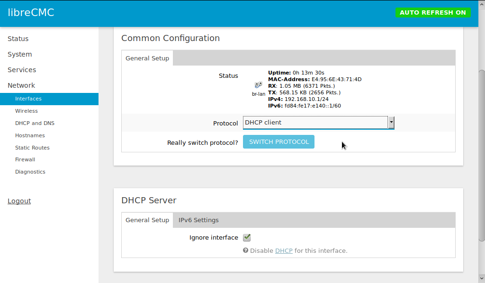

# Bridge Mode

A common feature of COTS Wi-Fi routers is to be able to set the router
to bridge mode, where the devices stops acting like an IP router
(layer 3) and starts acting like an ethernet switch (layer
2). LibreCMC does not actually have a bridge mode, but the same effect
is achievable with two easy steps.

1. Add the WAN ethernet port to the LAN bridge interface
2. Set the DHCP server to ignore the LAN interface

## Adjust the LAN bridge interface

Go to the Network >> Interfaces page and press the EDIT button next to
the LAN Network. Select the Physical Settings tab.


Place a checkmark in the box for the "eth0" interface for wan and
wan6. (I suppose the interface name might vary amongst different
routers.)


You can also check the box for Enable STP if desired. There doesn't
seem to be any downside from this, though I suppose it would use a
little more CPU cycles and memory. STP is a protocol intended to
prevent infinite communication loops from forming in a network of
layer 2 switches.

## Adjust DHCP server settings

On the same page, scroll down a little to the DHCP Server section. In
the General Setup tab, check the "Ignore interface" box.


Save and apply your changes.

## Communicating with LibreCMC in "bridge mode"

Now that the DHCP server is turned off, the next time you connect to
the libreCMC device, you will not be able to communicate with it. You
must set your connecting device manually to be on the same
subnet. Since the default libreCMC LAN IP address is 192.168.10.1/24,
it should work to set your connecting device to IP address
192.168.10.2/24.On Gnu/Linux systems, the command is usually `ip addr
add 192.168.10.2/24 dev eth0` or `dev wlan0` if connecting wirelessly.

Alternatively, you may set the libreCMC device to receive an IP
address from another DHCP server on your network: go to back to the
Network >> Interfaces page, press the EDIT button again next to the
LAN Network, select the General Setup tab, and switch the Protocol
from "Static address" to "DHCP client". (It seems that in LibreCMC,
bridging the LAN interface to the WAN port disables the operation of
the DHCP client on the WAN interface.) Of course, if you do this, be
sure that your DHCP server has reserved a memorable IP address for the
LibreCMC device's MAC address, so you don't have trouble finding it.



## Advanced

These adjustments are not required, but they lead to a configuration
which will be more consistent and have cleaner logs.

### Disabling odhcpd (DHCP daemon)

In bridge mode, you aren't going to want to serve DHCP out any
interface. So you might as well just shut down the whole DHCP
server. Log in via SSH, and run the commands:

```
/etc/init.d/odhcpd stop
/etc/init.d/odhcpd disable
```

### Delete the WAN(6) interfaces

From `Network` >> `Interfaces`, you can delete the WAN and WAN6
interfaces. See also the "Add a LAN6 interface" section below.

### Delete the WAN Firewall Zone

From `Network` >> `Firewall` you can delete the WAN zone. If you do
need a WAN firewall, then you should not be running in bridge mode in
the first place.

### Add a LAN6 Interface

If you have IPv6 access, you will want an interface which receives an
IPv6 address. From `Network` >> `Interfaces` create a new interface
called `LAN6` with `Protocol` set to `DHCPv6 client`.

You will likely also want to disable `odhcpd` (see above). Otherwise
your logs can get filled up with unnecessary IPv6 related messages, as
libreCMC tries to act like an IPv6 router. `odhcpd` normally handles
DHCPv6 as well as IPv6 Router Advertisements.
